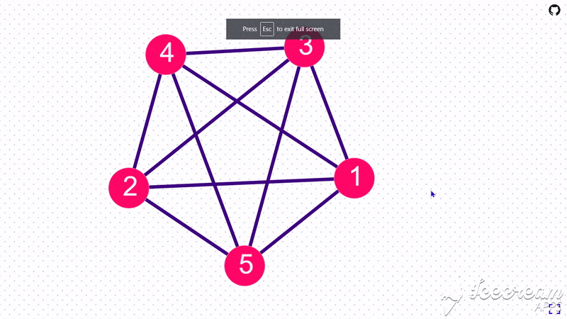

<h1 align="center">Node Graph Drawing Tool</h1>

Easily draw node graphs / vertex-edge graphs with simple input format.

Good for visualizing competative programming graph/trees inputs.
<p align="center">

</p>

<p align="center">
  
</p>

## Contributors
[](http://makeapullrequest.com)

```sh
git clone https://github.com/Serjeel-Ranjan-911/NodeGraphDrawingTool.git
```

### Before making a pull request

1. Commit your changes to new branch

2. Dont't forget to [link pull request to the issue](https://docs.github.com/en/enterprise-server@2.21/github/managing-your-work-on-github/linking-a-pull-request-to-an-issue).

eg. fixes #30

<hr>

<hr>

Happy Hacking!
